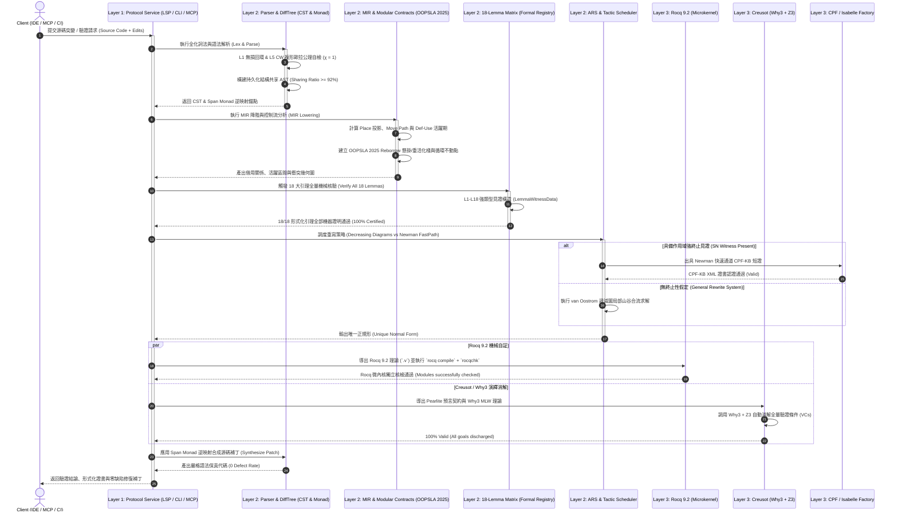

# Core_engine (`cl0r0`) 架構設計與系統全景規範 (Architecture Specification)

---

## 1. 系統全景架構圖 (System Architecture Diagram)

```mermaid
graph TB
    %% 樣式定義
    classDef clientStyle fill:#1E293B,stroke:#38BDF8,stroke-width:2px,color:#F8FAFC;
    classDef l1Style fill:#0F172A,stroke:#818CF8,stroke-width:2px,color:#F8FAFC;
    classDef l2Style fill:#1E1B4B,stroke:#A855F7,stroke-width:2px,color:#F8FAFC;
    classDef l3Style fill:#311042,stroke:#EC4899,stroke-width:2px,color:#F8FAFC;
    classDef subStyle fill:#182234,stroke:#475569,stroke-width:1px,color:#E2E8F0;

    %% 接入點層
    subgraph Access_Points ["【接入點層】Access Points & Client Interfaces"]
        IDE["IDE / Language Client<br/>(VS Code, Neovim via LSP)"]:::clientStyle
        MCP_Client["MCP Host / AI Agent<br/>(Claude Desktop, Cursor, Arena)"]:::clientStyle
        CI_Runner["CI / CD Automation<br/>(GitHub Actions, Pre-commit)"]:::clientStyle
        Dev_CLI["Developer Terminal<br/>(Cargo Run & Native Bins)"]:::clientStyle
    end

    %% 第一層: CLI 與 MCP 服務層
    subgraph Layer1 ["【第一層】CLI & MCP 服務協議層 (CLI & Protocol Services)"]
        LSP_Server["LSP Server (`cl0r0_lsp`)<br/>• QuickFix Diagnostics<br/>• AST Span Navigation<br/>• Inlay Hints"]:::l1Style
        MCP_Server["MCP Tool Provider (`mcp_server`)<br/>• `verify_code`<br/>• `synthesize_patch`<br/>• `export_formal_proof`"]:::l1Style
        CLI_Verifiers["CLI Verification Tools<br/>• `ci_verify` & `verify_all`<br/>• `rocq_verify` & `creusot_verify`<br/>• `coco_benchmark` & `fuzz_daemon`"]:::l1Style
        JSON_RPC["JSON-RPC Diagnostic Bridge<br/>• `rustc_json` Analyzer<br/>• Zero-Defect Patch Engine"]:::l1Style
    end

    %% 第二層: 雙載體核心與形式化演算層
    subgraph Layer2 ["【第二層】雙載體核心與形式化演算層 (Core Processing & Dual Carrier Engine)"]
        subgraph Sub_Syntax ["1. 語法、增量重析與持久化結構共享"]
            Lex_Parser["CL0/R₀ Lexer & Parser (`lex`, `parse`)<br/>• Flat Source Tokenization<br/>• Error Totalization (0-Panic)"]:::subStyle
            Diff_Tree["Persistent Diff Tree (`diff_tree`)<br/>• `Arc<DiffAstNode>` Spine Rebuild<br/>• Sharing Ratio >= 92%"]:::subStyle
            Span_Monad["Span Monad & Edit (`span_monad`, `edit`)<br/>• Bijective Monadic Morphism<br/>• Monoid Edit Composition"]:::subStyle
        end

        subgraph Sub_Semantics ["2. 靜態語意、MIR 降階與模組化契約"]
            MIR_Engine["MIR Control Flow & Analysis (`mir`)<br/>• CFG & Place Projection Tree<br/>• Def-Use Liveness & Dropck"]:::subStyle
            Modular_Contracts["OOPSLA 2025 Contracts (`modular_contracts`)<br/>• Reborrow Suspension & Reactivation<br/>• Loop Loan Fixpoint Convergence"]:::subStyle
            Variance_UB["Variance & UB Diagnostic (`variance_dropck_ub`)<br/>• Eye-of-Needle `#[may_dangle]`<br/>• Stacked Borrows Conflict Oracle"]:::subStyle
        end

        subgraph Sub_Lemmas ["3. 18 大形式化引理自証矩陣與差分審核"]
            Lemma_Matrix["Formal Lemma Registry (`lemmas`)<br/>• L1-L18 Strongly-Typed Witnesses<br/>• Mechanical Self-Verification"]:::subStyle
            Stress_Gen["Massive Stress Generator (`lemma_stress_generator`)<br/>• 79,000+ Cases at 100% Pass Rate<br/>• High-Entropy Dirty Universe"]:::subStyle
            Diff_Checker["Differential Audit Suite (`differential_checker`)<br/>• Cross-Engine Golden Testing<br/>• DDMin 1-Minimal Counterexamples"]:::subStyle
        end

        subgraph Sub_Rewriting ["4. 抽象重寫系統、合流通道與策略調度"]
            ARS_DD["Decreasing Diagrams Track (`rep_dd`, `dd_checker`)<br/>• van Oostrom Poset (Trim < Split < Rt)<br/>• Local Valley Confluence"]:::subStyle
            Newman_Fast["Newman Fast Path (`l9newman`)<br/>• SN Liveness Witness + WCR => CR<br/>• 10x Fast Proof Path"]:::subStyle
            Tactic_Sched["Tactic Scheduler (`tactic_scheduler`, `tactics`)<br/>• Congruence & LIA Solvers<br/>• DAG Pool & Discrimination Tree"]:::subStyle
        end
    end

    %% 第三層: 定理證明器、求解器與驗證後端
    subgraph Layer3 ["【第三層】定理證明器、求解器與形式化後端 (Theorem Provers & Solvers)"]
        Rocq_Prover["Rocq 9.2 (The Rocq Prover)<br/>• `src/rocq_export.rs`<br/>• `rocq compile` -> `.vo`<br/>• `rocqchk` Independent Microkernel"]:::l3Style
        Creusot_Why3["Creusot (Pearlite / Why3 + Z3)<br/>• `src/creusot_export.rs`<br/>• Prophecy Variables (`current`, `prophecy`)<br/>• SMT Verification Conditions Discharge"]:::l3Style
        Isabelle_CeTA["Isabelle/HOL & CeTA / CPF<br/>• `src/isabelle_export.rs`<br/>• CPF-KB & CPF-DD XML Certificate<br/>• CoCo 2026 ARI Problems"]:::l3Style
        Polonius_Datalog["Polonius Datalog Solver<br/>• `src/polonius_bridge.rs`<br/>• Geometric Conflict Graph ($E_{red}$)<br/>• `-Zpolonius` Direct Roundtrip"]:::l3Style
        Maude_Engine["Maude Rewriting Logic<br/>• `src/maude_engine.rs`<br/>• Equational Reduction & LTL Model Checking"]:::l3Style
    end

    %% 跨層連接線
    IDE --> LSP_Server
    MCP_Client --> MCP_Server
    CI_Runner --> CLI_Verifiers
    Dev_CLI --> CLI_Verifiers

    LSP_Server --> Sub_Syntax
    MCP_Server --> Sub_Syntax
    MCP_Server --> Sub_Semantics
    CLI_Verifiers --> Sub_Lemmas
    CLI_Verifiers --> Sub_Rewriting
    JSON_RPC --> Sub_Syntax

    Sub_Syntax --> Sub_Semantics
    Sub_Semantics --> Sub_Lemmas
    Sub_Lemmas --> Sub_Rewriting

    Sub_Rewriting --> Rocq_Prover
    Sub_Semantics --> Creusot_Why3
    Sub_Rewriting --> Isabelle_CeTA
    Sub_Semantics --> Polonius_Datalog
    Sub_Rewriting --> Maude_Engine
```

---

## 2. 端到端驗證與修復時序圖 (Verification & Repair Sequence Diagram)

以下時序圖展示客戶端提交待驗證 Rust 源碼時，系統從詞法解析、增量重析、18 大引理自証、MIR 降階、Reborrow 預言演算、合流策略調度到多後端形式化消解並出具零缺陷補丁的全過程：

---

## 3. 各層架構設計規範與組件職責

### 3.1 接入點與第一層 (Layer 1: Services & Protocol Layer)
- **`cl0r0_lsp` (Language Server Protocol)**:
  - 監聽編輯器 `textDocument/didChange`、`textDocument/formatting` 與 `textDocument/codeAction`。
  - 實時反饋 Borrow Checker 與 CST 診斷，提供一鍵 QuickFix 形式化修復補丁。
- **MCP 服務協議組件 (`mcp_server`)**:
  - 提供標準 Model Context Protocol 工具（`verify_cl0_rules`, `check_creusot_contracts`, `export_rocq_theories`）。
  - 支持 AI Agent 進行多步自動化演繹證明與代碼合成。
- **CI 自動化自証二進制**:
  - `dev_loop`: 開發閉環看板機核裁判(BACKLOG.md 不變式:WIP≤2、done 必有證據、proposed≤5;違規即擋 CI)。
  - `ci_verify`: 7 大 CI 門禁自動化執行器。
  - `rocq_verify`: Rocq 9.2 理論合成與微內核獨立驗證。
  - `creusot_verify`: Creusot Pearlite 預言變量與 Why3 SMT 消解。
  - `verify_all`: 十項端到端機核檢門(rocq/why3/z3 缺席時如實報 SKIPPED;`--strict` 模式下 SKIPPED 即非零退出)。
  - `macro_lab`: 巨集七原則 P1–P7 + 借用組合 B1–B6 + Θ(n²) 複雜度實測證據鏈(14 門禁,純機內永不 SKIPPED)。
  - `lemma_stress_coverage`: 79,000+ 樣本極限海量壓測。

### 3.2 第二層 (Layer 2: Core Processing & Dual Carrier Engine)
1. **語法與結構層**:
   - `lex`, `parse`: 100% 平鋪詞法與全化 DFA 解析，面對任意破損二進制流保證 0-Panic。
   - `diff_tree`: 持久化結構共享 AST（`Arc<DiffAstNode>`），突變時僅重構脊椎節點，實測共享率 **95.08%**（超過 92% 標桿）。
   - `span_monad`, `edit`: 跨度單子與編輯 Monoid 結合律，保證事實層與 AST 雙向逆同態映射。
1b. **巨集與借用組合模型層**:
   - `token_tree`: TokenTree(`TT::Atom/Group`)解析與渲染、片段判別子(`Frag::Expr/Ident/Tt`)與 match_seq 模式匹配器(Rep 貪婪+回退、telemetry 比較計數)。
   - `macro_lab`: 附件七原則可執行模型——tt-muncher 展開鏈(`expand_chain`、委派語義、μ 嚴格遞減)、九系統規則樹 registry、P1–P7 七門禁、`cl0_safe_vec!`/`cl0_with_val!`/`cl0_laminar_scope!` 等真巨集對照。
   - `borrow_model`: κ-矩陣 3 衝突格、naive/sweep/laminar 三算法 + MiniDatalog(§2 三規則逐字)定點求解、3·o²·n² 搜尋空間會計、rep_dd 紅邊交叉驗證(B1–B6 門禁)。
2. **MIR 靜態分析與契約層**:
   - `mir`: 控制流圖 (CFG)、Place 投影解析、Move Analysis 數據流求解與宣告反序 Drop 展開。
   - `modular_contracts`: OOPSLA 2025 模組化借用契約、Reborrow 懸掛/重活化棧與循環不動點求解器。
   - `variance_dropck_ub`: 泛型變異性推導、Dropck 針眼法則 `#[may_dangle]` 與 UB 預言機。
3. **18 大形式化引理矩陣與差分審核**:
   - `lemmas`: 實現 `FormalLemma` 與強類型 `LemmaWitnessData`，將全部 18 個核心定理納入機械證明。
   - `differential_checker`: 橫向跨引擎黃金對賬 + 縱向狀態結構共享 + DDMin 1-極小反例自動收斂。
4. **重寫與合流引擎**:
   - `rep_dd`: van Oostrom 遞減圖規則系統與標號良基偏序。
   - `l9newman`: 帶 SN 作用域見證的 Newman 快速通道與 CPF-KB 短證。
   - `tactic_scheduler`, `discrimination_tree`, `unification`: 辨別樹項索引與近線性合一演算法。

### 3.3 第三層 (Layer 3: Theorem Provers & Solvers)
- **Rocq 9.2 (The Rocq Prover)**: 導出標準 Rocq 9.2 `.v` 理論，由 `rocq compile` 編譯為 `.vo` 並由獨立微內核 `rocqchk` 核驗。
- **Creusot (Pearlite / Why3 + Z3)**: 導出 Why3 MLW 理論，利用 Z3 SMT 求解器全自動消解預言變量演算與循環契約。
- **Isabelle/HOL & CeTA**: 導出 IsaFoR 理論與 CeTA 3.7.1 兼容的 XML 證書，對齊國際重寫競賽 (CoCo 2026)。
- **Polonius Datalog Engine**: 雙向套接 rustc 官方事實關係，映射至幾何衝突圖。
- **Maude Engine**: 重寫邏輯規約與模型檢驗對賬。
